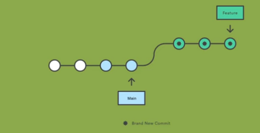
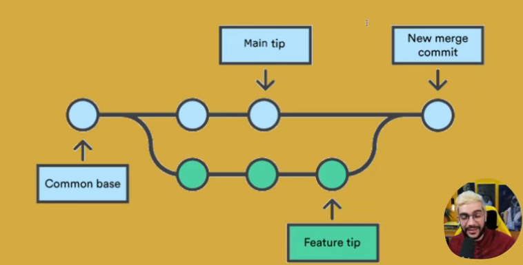
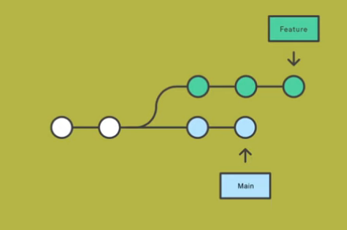
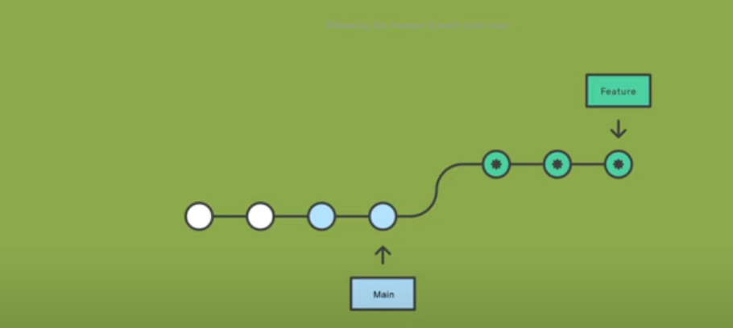

# Clase 2

Repositorio: Proyecto que tiene codigo. 

## Git

Es un sistema de control de versiones distribuido gratuito y Open sourse. 

**Open source no significa gratis**

*Buscar: ¿Cuál es la diferencia entre un sistema de de control de versiones distribuido y uno centralizado?*

## Control de versiones

### Git Staging Area

Es el lugar donde se ponen todos las cosas que ya estas listas para ser usadas por el usuario. Todo lo que este en esta zona se va al commit. 

### Como crear un repositorio local. 

1. git init 
2. git status
3. git add .
4. 

### Branches 

Son los cambios en el tiempo, y normalmente tenemos la rama principal. Pero tambien tenemos bifurcaciones llamadas features que son funcionalidades que se desarrollan al mismo tiempo. 

### Merge

Sirve para mezclar las bifurcaciones que teniamos y añadirlas a la rama principal con un commit.  

### Rebase

Tenemos la rama principal y esta lo que hace es poner las ramas al principio de la rama principal, modifcando el historial y si no se tiene cuidado causando problemas. 

**Regla de oro: nunca hacer rebase en ramas publicas**

### Git y los repositorios remotos. 

Para eso seguimos los siguientes pasos: 

1. git remote add origin <url>
2. git push -u origin main
3. git pull origin main

**Para usar el eleventy  npx @11ty/eleventy --serve**