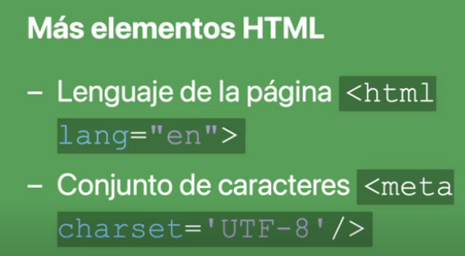

# Introduccion a HTML

## ¿Qué es una etiqueta HTML?

Es una etiqueta utilizada en el lenguaje de marcado HTML para identificar y definir elementos en una pagina web.

Recordamos que HTML es **"Hyper Text Markup Language"**

En HTML el uso de etiquetas se hace dentro de los "< > </ >" y la mayoria estan definidas ya como parte de la sitaxis del texto.

Todo lo que esta dentro de estas etiquetas seria considerado el "Elemento" HTML.

**< html >** => Etiqueda apertura.

**< /html >** => Etiqueda apertura.

## Estructura básica de una pagina web

~~~html
<!DOCTYPE html > <!-- HTML5 -->
<html>
    <head>
        <!-- Aquí va la meta-información -->
    </head> 
    <body>
        <!-- Aquí va el contenido -->
    </body>
</html>
~~~

### Mas elementos de HTML

## Enlaces absolutos, relativos y relativos a la raiz

### Absolutos

Son links que nos mandan a paginas externas. Y se conforman por:

* Schema: https://
* Domain: en.wikipedia.org
* Path: /wiki/Sweden

### Relativos

Viaje dentro de la carpeta

### Relativos a la raiz

Van a un archivo, pero siempre desde la raiz.

### Notas 

* investigar que es vite