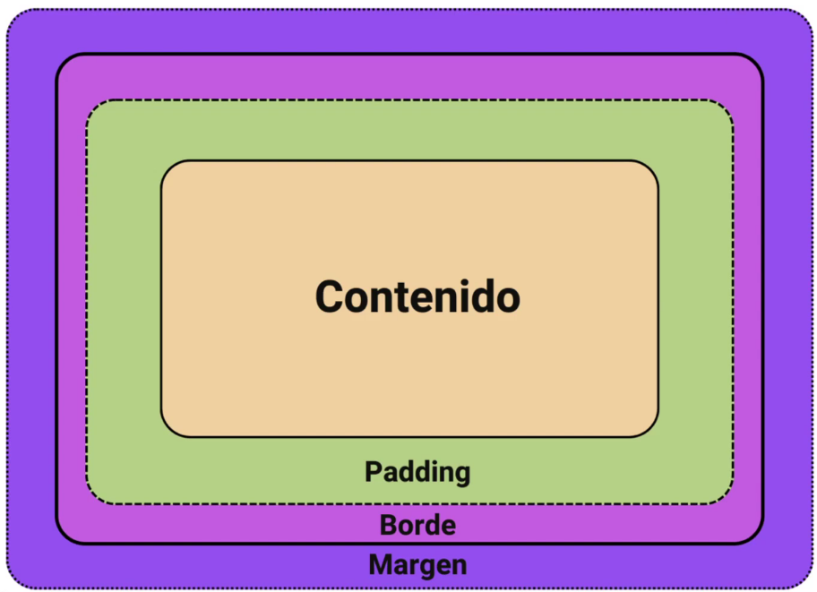
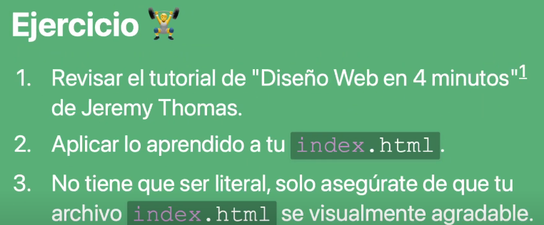

# Introduccion a CSS

## ¿Qué es el CSS?

Las hojas de estilo en cascada son un lenguaje de estilo utilizado para describir la presentaicon de un documento HTML.

Incluyendo aspectos como el diseño, los colores, las fuentes, los tamaños, etc.

~~~CSS

~~~

En el codigo anterior tenemos lo siguiente:

* Selector: body
* Propiedades: background, font-size
* Valores: tomato, 16px
* Unidad: px

## Enlazar una hoja de estilos

~~~CSS
<link rel="stylesheet" href="estilo.css">
~~~

Asi tendremos una hoja de estilos.

## Modelo de caja en CSS

Los encabezados h1 son de tipo bloque, tambien los parrafos p. Sin embargo los elementos de énfasis en cursica em y enfasis en negrilla strong son elementos en linea. 

### Elementos tipo bloque

Estos siempre aparecen debajo del elemento del bloque anterior, y su ancho se establecec atuomaticamente en funcion del ancho de su contenedor principal. La altura de los elementos de bloque se basa en el contenido que contiene.

### Elementos en linea

**No afectan al espacio vertical**, y el ancho de los elementos en línea se basa en el contenido que contienen, no en el ancho del elemento principal.

### Contenido, Padding, Borde y Margen

* **Contenido**: es el texto, las imagenes o cualquier otro contenido multimedia.
* **Padding**: es el espacio entre el contenido de la caja y su borde.
* **Borde**: en la linea entre el relleno y el margen del cuadro.
* **Margen**: el espacio entre la caja y las cajas alrededor de esta.

### Consideraciones del modelo de caja

* Los elementos en linea no se ven afectados por el margen vertical
* Colapso vertical del margen ya se que queda el margen mas grande y se sobreescriben, sin sumarse.
* Dimensiones explicitas, ya que se pueden establecer manulamente.
* Tamaño de la caja, significa que todo se suma.

## Como funcionan los selectores CSS

* Tipo: para secciones como el body, div, etc.
* .selector-de-clase
* #selector-de-id
* [atributo]
* " * "

~~~HTML

Este parrafo tiene una clase, un posible estilo compartido

Este parrafo tiene un identificador, qeu debera ser unico para todo el documento

~~~

### Combinaciones de selectores

* Adyacente .primero + .segundo: seleccionan todo lo que este despues del primero
* Hijo .padre > .hijo: solo si el hijo tiene ese padre se selecciona. 
* Descendiente .abuelo .bisnieto: tiene que estar uno dentro de otro
* Hermano .hermano ~ .hermana: No importa si hay cosas en el medio, mientras esten en le mismo nivel. 

### Como funciona el layout

### Cascada y especificidad en CSS

1. **Posición y orden**: el orden en que se declaran las relgas CSS. El ultimo declarado tiene prioridad. 
2. **Especificidad**: un algoritmo que determina que selsctro de CSS tiene mas peso. 
3. **Origen**: el orden en que aparece CSS y de donde proviene, ya que sea un estilo de navegador, el CSS de una extencion o nuestro CSS.
    * **User agent base styles**: Estos son los estilos que su navegador aplica a los elementos HTML por defecto.
    * **Local user styles**: Estos pueden prevenir del nivel del sistema operativo, como un tamaño de fuente base o una preferencia de movimiento reducido. Tambien pueden prevenir de extenciones de navegador.
    * **Authored CSS**: el css que creas.
    * **Local user styles !important**: Cualquier !important que provenga del nivel del sistema operativo o del nivel de extencion del navegador CSS.
    * **User agent !important**: Cualquier !important que este definido en el CSS predeterminado, proporcionado por el navegador.
4. **Importancia**: algunas relgas CSS tienen mas peso que otras especialmente con el tipo de regla !important, **no se usa nunca!!!!**
    * Reglas normales, como font-size, background o color.
    * Reglas de animacion.
    * Reglas !important (siguiendo el mismo orden que el origen)
    * Reglas de transicion.

# Ejercicio

