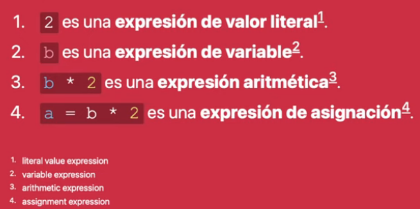

# Introducción a la programación y JavaScript

## ¿Qué es el código y los algoritmos?

El código es un conjunto de **instrucciones** que le dicen a la computadora qué tareas realizar.

Estas instrucciones se llaman **algoritmos**, por lo que un código podría tener uno o más **algoritmos**.

### Algoritmos en diferentes areas

1. En matemáticas, se utilizan algoritmos para realizar cálculos y resolver problemas.
2. En física, se utilizan para algoritmos para modelar y simular sistemas físicos.
3. En química, se utilizan algoritmos para predecir y modelar la estructura y el comportamiento de moléculas.
4. En biología, se utilizan algorimtos para analizar y procesar grandes cantidades de datos genómicos y proteómicos.

### Sentencias y Expresiones en los lenguajes

### Expresión

Es una combinacion de valores, variables, operaciones y funcions que se evalua para producir un resultado.

**ejemplos**

1. 5 + 3 => esta expresion suma los números 5 y 3, devuelve el resultado 8. 
2. x * y => esta expresion multiplica dos variables x e y, y devuleve el resultado

### Sentencia

Es una instruccion que realiza una acción en el programa.

Estas pueden cambiar el estado de las varibaels, realizar operaciones de entrada/salida, controlar el flujo de ejecución del programa, entro otras acciones.

**ejemplos**

~~~java
si (x > 5) {imprimir("x es mayor que 5");}
~~~

👆 esta sencentencia comprueba si el valor de la variable c es mayor que 5 y si lo es, muestra un mensaje. 

Y una sentencia esta compuesta por una o mas expresiones.

### ¿Qué son los operadores en la programación?

Los operadores son simbolos o palabras reservadas que se utilizan para realizar operaciones o comparaciones entre valroes o variables.

1. Operadores Aritmeticos
2. Operadores de asignacion
3. Operadores de comparacion
4. Operadores logicos.

### Valores y tipoos en el código

Tenemos los siguientes: 

* Numeros Number
* Cadena de texto String
* Booleano Boolean

### Lenguajes interpretados y compilados

La diferencia es el proceso de traduccion del codigo fuente a un programa ejecutable.

* **Compilado**: usa un compilador para traducir el codigo fuente en el lenguaje de maquina. (C++, Java)

* **Interpretado**: usa interprete para traducir el texto codigo fuente a lenguaje de maquina en tiempo de ejecucion. (PHP, Python)

## JavaScript 101

### Tipos y valores en JavaScript

### Valores primitivos 

Hay 7 valores primitivos:

1. Booleans (true y false)
1. Numbers (100, 3.14)
1. Strings ("hola", 'Hola')
1. Symbols (Symbol()) => Crear un valor unico
1. BigInts(10n)
1. Undefined (undefined)
1. Null (null)

### Operador typeof

typeof null

En un inicio 

### Objetos y funciones

- Objects  ( { } )
- Funciones x => x * 2

**Todo lo en JavaScript que no sea un valor primitivo es un objeto**

### Variables

| Propiedad    | var     | let | const |
|--------------|---------| ----- |---- |
| scope (alcance)      | funcion    |   bloque | bloque|
| re-asignación   | ✔ | ✔ |❌ |
| re-declaración        |  ✔  | ❌ | ❌|

### Igualdad en JavaScript

- Loose-equality == (Solo verifica valor)
- Strict-equality === (Verifica valor y tipo) **Siempre usar este**

### Falsy, Truthy y Nullish en JavaScript

Los valores falsy en JavaScript

1. false: el valor vooleano falso.
1. 0: el numero cero.
1. -0: el numero cero negativo.
1. 0n: el BigInt cero.
1. "": cadena de texto vacia.
1. null: un valor nulo.
1. undefined: un valor no definido.
1. NaN: un valor que representa "Not a Number".

**Cualquier otra cosa que no este en la lista anterior pertenece a truthy**

Los valores nullish son:

- Null
- Undefined