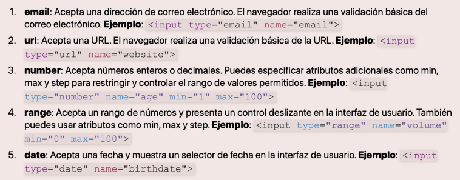
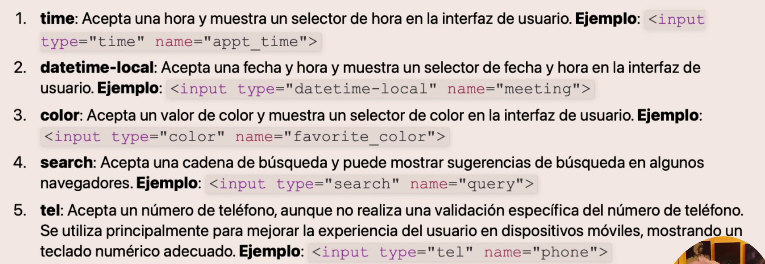
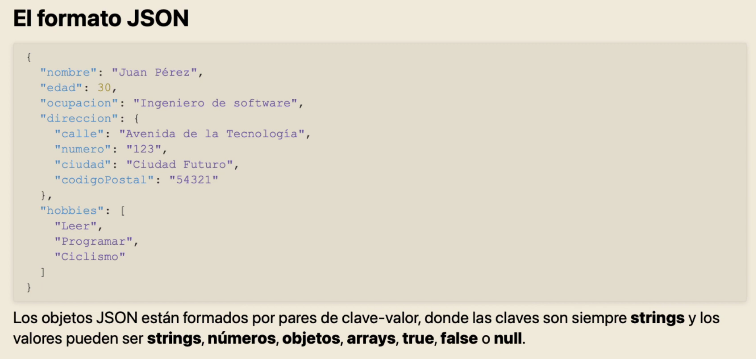
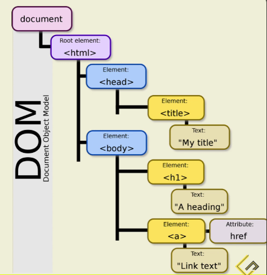
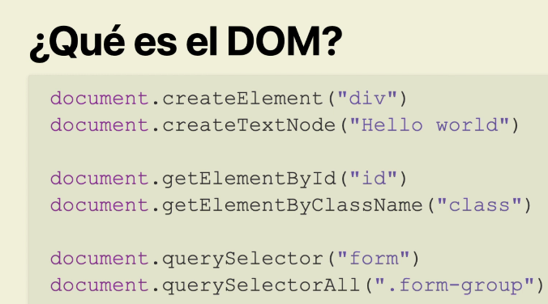

# Formularios HTML

## Formularios clásicos en HTML

~~~HTML
<form action='/server' method = 'get' class ='form'></form>
~~~

Tenemos varias características como:

- action => indica donde se va a mandar la información y se especifica la URL del servidor.
- method => que indica la forma en la que se manda la información.

Y todo esto se basa en el modelo Cliente-Servidor.

## Inputs en formularios HTML

## Diferencia entre botones y enlaces

### Enlaces

- Se crean utilizando la etiqueta < a > en HTML
- Su principal propósito es navegar entre páginas o secciones dentro de una página web.

### Botón

- Se crean utilizando la etiqueta < button > o < input type ="button"> en HTML.
- Su principal propósito es realizar acciones especificas en la página, como enviar formularios activar elementos de JavaScript, entre otros.

## Controles modernos para formularios

**tel** no hace validación pero en móvil se accede directo al teclado numérico.

## Formato JSON

JSON (JavaScript Object Notation) es un formato de intercambio de datos ligero y fácil de leer tanto para humanos como máquinas.

Se utiliza ampliamente para transmitir datos en aplicaciones web entre el cliente y el servidor, así como: 

## ¿Qué es el DOM?

El DOM (Document Object Model) es una representación en forma de árbol de los elementos y la estructura de una pagina web.

EL DOM es una interfaz de programación que permite a los desarrolladores interactuar y manipular el contenido, la estructura y el estilo de una pagina web utilizando JavaScript.

Usando JavaScript podemos acceder al DOM, pero es algo del navegador. Es una API.

## ¿Qué es el CSSOM?

El CSSOM (CSS Object Model) es una representación en forma de árbol de todos los estilos CSS asociados con una pagina web.

Al igual que el DOM representa la estructura y el contenido de una pagina web, el CSSOM representa la información de estilo de la pagina.

**Consejo** : tecnologías como react, angular, etc solo son abstracción del DOM. Librerías que por abajo llaman la API del DOM.